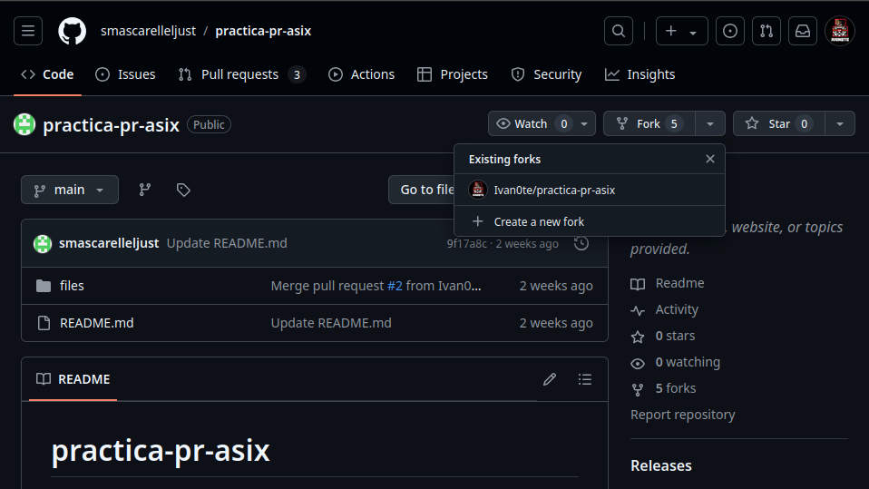
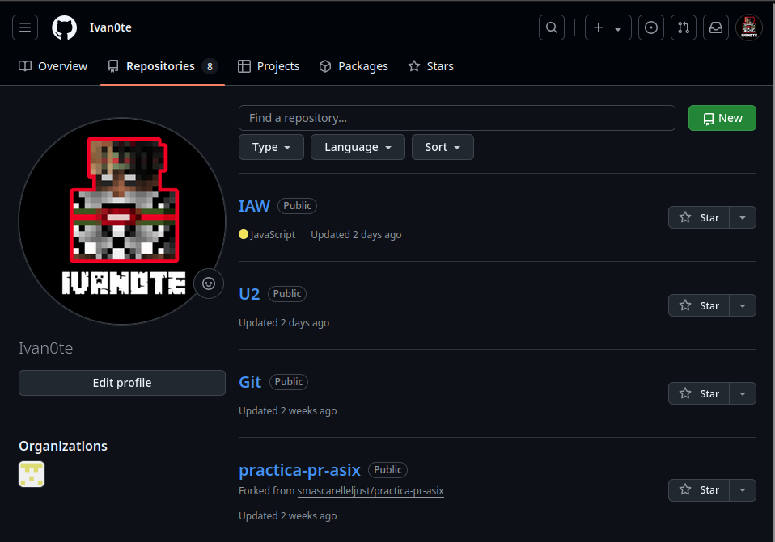
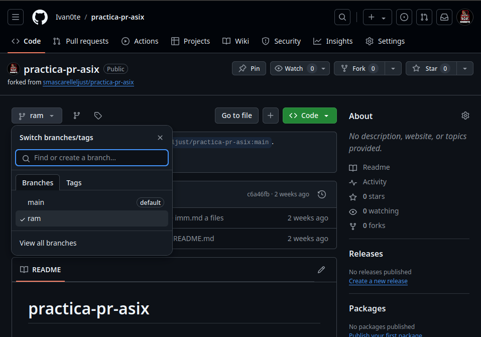

!!! success "Objetivos"

    En esta práctica vamos a desplegar una página web estática con MkDocs en GitHub Pages. Como esta que estás viendo. Para ello, deberás seguir los siguientes pasos:

    - Conocer el concepto de Pull Request.
    - Conocer la metodología para colaborar en proyectos alojados en GitHub realizando Pull Requests.

## Practica a entregar

1. Documentación de los pasos fundamentales (con instrucciones) para realizar el pull request.

2. Lo primero es hacer un fork del repositorio al que quieres contribuir.

    

3. Nos creara un nuevo repositorio en la cuenta de el usuario.
   
    

4. Una vez que hemos copiado el repositorio a nuestra cuenta, podemos clonar ese repositorio. Comando para realizar la clonación: 
    
    ```git clone git@github.com:Ivan0te/practica-pr-asix.git```

5. A continuación vamos a crear una nueva rama, donde realizaremos los cambios que posteriormente propondremos como cambios. Para crear la rama ejecutamos:
    ```git checkout -b ram```
    