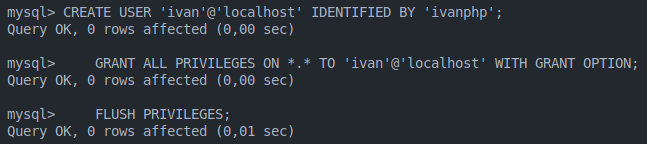

# Practica 03: Instalar, configurar y securizar phpMyAdmin

## Instalar phpMyAdmin

1. Para instalar phpMyAdmin, vamos a utilizar el paquete de instalación de Debian/Ubuntu:
```bash
sudo apt install phpmyadmin
```

2. Instalaremos las dependencias necesarias para phpMyAdmin:
```bash
sudo apt install php-mbstring php-xml php-zip php-gd php-curl php-json
```

3. Ahora, vamos a crear un usuario para phpMyAdmin:
```bash
sudo mysql -u root -p
```

4. Crearemos un usuario para phpMyAdmin:
```sql
CREATE USER 'php'@'localhost' IDENTIFIED BY 'root';
GRANT ALL PRIVILEGES ON *.* TO 'php'@'localhost' WITH GRANT OPTION;
FLUSH PRIVILEGES;
```

5. Habilitamos la extensión mbstring y reiniciamos el servicio de Apache:
```bash
sudo phpenmod mbstring
sudo systemctl restart apache2
```


6. Automatización de la instalación de LAMP

```bash
# Instalar PHP
sudo apt update -y 
sudo apt install php libapache2-mod-php -y

# Paquetes Opcionales
sudo apt install php-cli -y
sudo apt install php-cgi -y
sudo apt install php-mysql -y
sudo apt install php-pgsql -y

# Instalar phpmyadmin
sudo apt install phpmyadmin php-mbstring php-zip php-gd php-json php-curl -y    

# Acceder a MySQL para modificar configuración
sudo mysql -e 'UNINSTALL COMPONENT "file://component_validate_password";'

# Crear un nuevo usuario en MySQL con todos los privilegios
sudo mysql -e "CREATE USER 'php'@'localhost' IDENTIFIED BY 'root';"
sudo mysql -e "GRANT ALL PRIVILEGES ON *.* TO 'php'@'localhost' WITH GRANT OPTION;"
sudo mysql -e "FLUSH PRIVILEGES;"

# Reiniciar servidor Apache
sudo systemctl restart apache2
```

[Descargar](../scripts/autophp.sh){ .md-button .md-button--primary }

## Configuración de MYSQL

1. Configuración del Acceso por Contraseña para la Cuenta Root de MySQL
    1. Cambia el método de autenticación del usuario root de MySQL.

    ```sql
    sudo mysql -u root -p
    ALTER USER 'root'@'localhost' IDENTIFIED WITH 'caching_sha2_password' BY 'Root_pass1';
    FLUSH PRIVILEGES;
    ```

    2. Verifica los métodos de autenticación empleados por cada uno de tus usuarios.

    ```sql
    SELECT user,authentication_string,plugin,host FROM mysql.user;
    ```


2. Configuración de la Contraseña de la Cuenta de Usuario de MySQL

    1. Crea una nueva cuenta de usuario con el nombre de usuario 'ivan' y la contraseña 'ivanphp'.
    2. Darle al nuevo usuario todos los privilegios de la cuenta root.

    ```sql
    CREATE USER 'ivan'@'localhost' IDENTIFIED BY 'ivanphp';
    GRANT ALL PRIVILEGES ON *.* TO 'ivan'@'localhost' WITH GRANT OPTION;
    FLUSH PRIVILEGES;
    ```

    

## Asegurar PhpMyAdmin

1. Habilitar sobrescritura de archivos .htaccess en el configuración de Apache y agregamos **AllowOverride All** en la sección **Directory** del archivo de configuración de Apache.

    ```bash
    sudo nano /etc/apache2/conf-available/phpmyadmin.conf
    ```

    

    Reiniciamos el servicio de Apache.

    ```bash
    sudo systemctl restart apache2
    ```

2. Crea un archivo .htaccess en el directorio de phpMyAdmin.
    
    ```bash
    sudo nano /usr/share/phpmyadmin/.htaccess
    ```

    Dentro de dicho archivo, agregamos las siguientes líneas de código:
    ```bash
    AuthType Basic
    AuthName "Restricted Files"
    AuthUserFile /etc/phpmyadmin/.htpasswd
    Require valid-user
    ```

3. Crea un archivo .htpasswd para almacenar las credenciales de usuario y contraseña.

    ```bash
     sudo htpasswd -c /etc/phpmyadmin/.htpasswd ivanphp
    ```

    

4. Reiniciamos el servicio de Apache.

```bash
sudo systemctl restart apache2
```

