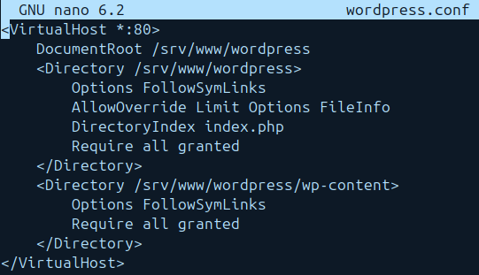
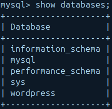
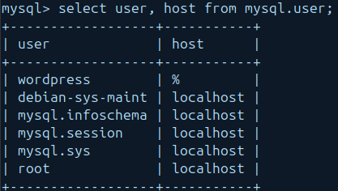
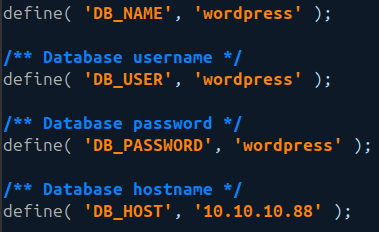
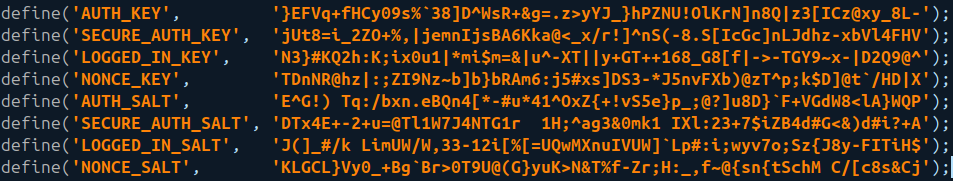
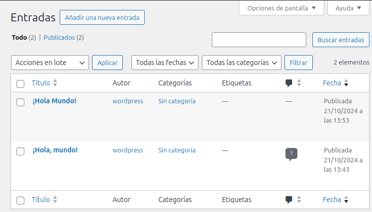

## 1. Descripción general

!!! success "Objetivos"

    - Instalar PHP y Apache
    - Instalar WordPress
    - Configurar Apache para WordPress
    - Configurar la base de datos
    - Implantar una aplicación web con WordPress en una arquitectura de 2 niveles

## 2. Instalar dependencias

Para poder instalar PHP y Apache, tendremos que instalar algunas dependencias. Para ello, ejecutaremos el siguiente comando:

```bash
sudo apt update
sudo apt install apache2 ghostscript libapache2-mod-php mysql-server php php-bcmath php-curl php-imagick php-intl php-json php-mbstring php-mysql php-xml php-zip -y
```

## 3. Instalar WordPress

Una vez instaladas las dependencias, podemos instalar WordPress. Para ello, ejecutaremos el siguiente comando:

```bash
sudo mkdir -p /srv/www
sudo chown www-data: /srv/www
curl https://wordpress.org/latest.tar.gz | sudo -u www-data tar zx -C /srv/www
```

## 4. Configurar Apache para WordPress

Ahora, vamos a configurar Apache para que pueda servir WordPress. 
Crearemos un archivo de configuración para WordPress en el directorio /etc/apache2/sites-available/wordpress.conf con el siguiente contenido:

```bash
<VirtualHost *:80>
    DocumentRoot /srv/www/wordpress
    <Directory /srv/www/wordpress>
        Options FollowSymLinks
        AllowOverride Limit Options FileInfo
        DirectoryIndex index.php
        Require all granted
    </Directory>
    <Directory /srv/www/wordpress/wp-content>
        Options FollowSymLinks
        Require all granted
    </Directory>
</VirtualHost>
```



Acto seguido, habilitaremos el sitio con el siguiente comando:

```bash
sudo a2ensite wordpress
```

Habilitamos la reescritura de URLs con el siguiente comando:

```bash
sudo a2enmod rewrite
``` 

Y Deshabilitamos el sitio predeterminado con el siguiente comando:

```bash
sudo a2dissite 000-default.conf
```

Reiniciaremos el servicio de Apache con el siguiente comando:

```bash
sudo systemctl restart apache2
```

## 5. Configurar la base de datos

Una vez arrancado el segundo servidor, este dedicado a la base de datos, inicia sesión en MySQL con:

```bash
mysql -u root -p
```

Crearemos una base de datos llamada wordpress:

```sql
CREATE DATABASE wordpress;
```



Crearemos un usuario llamado wordpress:

```sql
CREATE USER 'wordpress'@'%' IDENTIFIED BY 'wordpress';
GRANT SELECT,INSERT,UPDATE,DELETE,CREATE,DROP,ALTER
    ON wordpress.*
    TO wordpress@%;
FLUSH PRIVILEGES;
```



Habilita MySQL con:

```bash
sudo service mysql start
```

## 6. Configurar WordPress para conectarse a la base de datos

Ahora, configuremos WordPress para usar esta base de datos. Primero, copia el archivo de configuración de muestra a wp-config.php:

```bash
sudo -u www-data cp /srv/www/wordpress/wp-config-sample.php /srv/www/wordpress/wp-config.php
```

Luego, establece las credenciales de la base de datos en el archivo de configuración (no reemplaces database_name_here o username_here en los comandos a continuación. Reemplaza <tu-contraseña> con tu contraseña de base de datos.):

```bash
sudo -u www-data sed -i 's/database_name_here/wordpress/' /srv/www/wordpress/wp-config.php
sudo -u www-data sed -i 's/username_here/wordpress/' /srv/www/wordpress/wp-config.php
sudo -u www-data sed -i 's/password_here/<tu-contraseña>/' /srv/www/wordpress/wp-config.php
```



Finalmente, en una sesión de terminal abre el archivo de configuración en nano:

```bash
sudo -u www-data nano /srv/www/wordpress/wp-config.php
```
Encuentra lo siguiente:

```bash
define( 'AUTH_KEY',         'pon tu frase única aquí' );
define( 'SECURE_AUTH_KEY',  'pon tu frase única aquí' );
define( 'LOGGED_IN_KEY',    'pon tu frase única aquí' );
define( 'NONCE_KEY',        'pon tu frase única aquí' );
define( 'AUTH_SALT',        'pon tu frase única aquí' );
define( 'SECURE_AUTH_SALT', 'pon tu frase única aquí' );
define( 'LOGGED_IN_SALT',   'pon tu frase única aquí' );
define( 'NONCE_SALT',       'pon tu frase única aquí' );
```

Elimina esas líneas (ctrl+k eliminará una línea cada vez que presiones la secuencia). Luego reemplázalas con el contenido de https://api.wordpress.org/secret-key/1.1/salt/. (Esta dirección es un randomizador que devuelve claves completamente aleatorias cada vez que se abre.) Este paso es importante para asegurar que tu sitio no sea vulnerable a ataques de “secretos conocidos”.

Guarda y cierra el archivo de configuración escribiendo ctrl+x seguido de y y luego enter.



## 7. Configurar WordPress

Abre http://localhost/ en tu navegador. Se te pedirá el título de tu nuevo sitio, nombre de usuario, contraseña y dirección de correo electrónico. Ten en cuenta que el nombre de usuario y la contraseña que elijas aquí son para WordPress, y no proporcionan acceso a ninguna otra parte de tu servidor: elige un nombre de usuario y una contraseña que sean diferentes de tus credenciales de MySQL (base de datos), que configuramos para el uso de WordPress, y diferentes de tus credenciales para iniciar sesión en tu computadora o en el escritorio o shell de tu servidor. Puedes elegir si deseas que tu sitio sea indexado por los motores de búsqueda.

### Instalación de WordPress

Ahora puedes iniciar sesión en http://localhost/wp-login.php. En el Panel de WordPress, verás un montón de íconos y opciones. ¡Explora un poco! Puedes cambiar el tema, instalar plugins, escribir publicaciones y páginas, y mucho más.


## 8. Escribe tu primera publicación

Notarás la publicación “¡Hola mundo!”. Vamos a eliminarla y escribir algo más interesante…
Todas las publicaciones

Desde el Panel de control (http://localhost/wp-admin/), selecciona el ícono “Publicaciones” y haz clic en “Todas las publicaciones”. Pasa el ratón sobre el título de la publicación “¡Hola mundo!” y selecciona Papelera.

