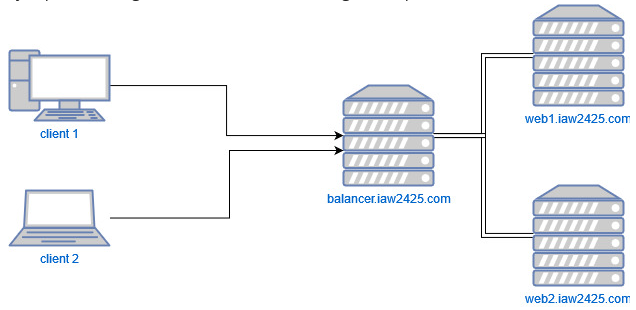
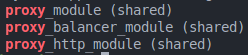

!!! warning "Requisitos previos"
    - Tres servidores ejecutando un sistema operativo Ubuntu.
    - Un usuario root o un usuario con privilegios sudo.
    - Usaremos los siguientes dominios: 
        - web1.iaw2425.com
        - web2.iaw2425.com
        - balancer.iaw2425.com

## Ejemplo de configuración del Balanceador de Carga



## Actualizar Paquetes del Sistema

```bash
sudo apt update
sudo apt upgrade
```

## Instalar Apache

```bash
sudo apt install apache2
```

## Configurar el Primer Servidor Backend Apache
Crearemos una pagina HTML de muestra y un archivo de configuración del host virtual en el primer servidor Apache.

```bash
nano /var/www/html/web1.html
```

Agregaremos el siguiente contenido:

```html
<!DOCTYPE html PUBLIC "-//W3C//DTD XHTML 1.0 Transitional//EN" "http://www.w3.org/TR/xhtml1/DTD/xhtml1-transitional.dtd">
<title>Servidor Web Apache 1</title>
<h2>¡Esta es la página del Servidor Web Apache 1!</h2>
</html>
```

Guardamos y cerramos el archivo con Ctrl+O y Ctrl+X.

Ahora, creamos el arhcivo de configuración del host virtual en el primer servidor Apache.

```bash
nano /etc/apache2/sites-enabled/web1.conf
```

Agregaremos el siguiente contenido:

```bash
<VirtualHost *:80>
    ServerName web1.iaw2425.com
    ServerAdmin webmaster@localhost
    DocumentRoot /var/www/html
    DirectoryIndex web1.html
    ErrorLog ${APACHE_LOG_DIR}/error.log
    CustomLog ${APACHE_LOG_DIR}/access.log combined
</VirtualHost>
```

Guardamos y cerramos el archivo con Ctrl+O y Ctrl+X.

Ahora, reiniciamos el servicio Apache.

```bash
sudo systemctl restart apache2
```

Para comprobar que todo funciona correctamente, vamos a acceder a la URL web1.iaw2425.com.


## Configurar el Segundo Servidor Backend Apache
Crearemos una pagina HTML de muestra y un archivo de configuración del host virtual en el segundo servidor Apache.

```bash
nano /var/www/html/web2.html
```

Agregaremos el siguiente contenido:

```html
<!DOCTYPE html PUBLIC "-//W3C//DTD XHTML 1.0 Transitional//EN" "http://www.w3.org/TR/xhtml1/DTD/xhtml1-transitional.dtd">
<title>Servidor Web Apache 2</title>
<h2>¡Esta es la página del Servidor Web Apache 2!</h2>
</html>
```

Guardamos y cerramos el archivo con Ctrl+O y Ctrl+X.

Ahora, creamos el arhcivo de configuración del host virtual en el segundo servidor Apache.

```bash
nano /etc/apache2/sites-enabled/web2.conf
```

Agregaremos el siguiente contenido:

```bash
<VirtualHost *:80>
    ServerName web2.iaw2425.com
    ServerAdmin webmaster@localhost
    DocumentRoot /var/www/html
    DirectoryIndex web2.html
    ErrorLog ${APACHE_LOG_DIR}/error.log
    CustomLog ${APACHE_LOG_DIR}/access.log combined
</VirtualHost>
```

Guardamos y cerramos el archivo con Ctrl+O y Ctrl+X.

Ahora, reiniciamos el servicio Apache.

```bash
sudo systemctl restart apache2
```

Para comprobar que todo funciona correctamente, vamos a acceder a la URL web2.iaw2425.com.


## Configurar el Balanceador de Carga

Configuraremos el tercer servidor como un servidor de balanceo de carga para redirigir todo el tráfico a los servidores web.

Tendremos que habilitar los módulos proxy en el servidor de balanceo de carga:

```bash
a2enmod proxy
a2enmod proxy_http
a2enmod proxy_balancer
a2enmod lbmethod_byrequests
```

!!! info "Módulos de Apache"
    - proxy: Permite el uso de proxys en Apache.
    - proxy_http: Permite el uso de proxys en Apache.
    - proxy_balancer: Permite el uso de balanceadores de carga en Apache.
    - lbmethod_byrequests: Permite el uso de métodos de balanceo de carga en Apache.

Reiniciamos el servicio Apache.

```bash
sudo systemctl restart apache2
```

Verificamos todos los módulos de Apache.

```bash
apachectl -M | grep proxy
```



Creamos el archivo de configuración del balanceador de carga.

```bash
nano /etc/apache2/sites-enabled/balancer.conf
```

Agregaremos el siguiente contenido:

```bash<VirtualHost *:80>
    ServerName balancer.iaw2425.com
    <Proxy balancer://webserver>
        # servidor 1
        BalancerMember http://web1.iaw2425.com
        #BalancerMember http://IP_HTTP_SERVER_1:80

        #servidor 2
        BalancerMember http://web2.iaw2425.com
        #BalancerMember http://IP_HTTP_SERVER_1:80

        ProxySet stickysession=ROUTEID
    </Proxy>
    ProxyPreserveHost On
    ProxyPass / balancer://webserver/
    ProxyPassReverse / balancer://webserver/
</VirtualHost>
```

Guardamos y cerramos el archivo con Ctrl+O y Ctrl+X.

Ahora, reiniciamos el servicio Apache.

```bash
sudo systemctl restart apache2
```

Para comprobar que todo funciona correctamente, vamos a acceder a la URL balancer.iaw2425.com.


## Configuración de la Política de Balanceo de Carga

Para configurar la política de balanceo de carga es necesario tener activado previamente el módulo proxy_balancer en el servidor de balanceo de carga.

```bash
sudo a2enmod proxy_balancer
```

Creamos el archivo de configuración de la política de balanceo de carga.

El balanceo de carga que voy a utilizar es el Round Robin.

Para poder activar este método de balanceo tenemos que activar el módulo lbmethod_byrequests.

```bash
sudo a2enmod lbmethod_byrequests
```

Este método de balanceo también permite distribuir las peticiones entre los servidores en función de los parámetros lbfactor y lbstatus.

Ahora reiniciamos el servicio Apache.

```bash
sudo systemctl restart apache2
```
## Verificar el Balanceo de Carga con Apache


